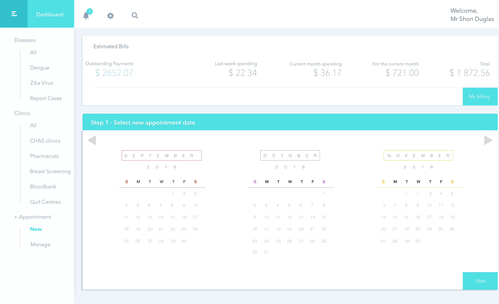

# One-Stop Health

# Problem

The problem with the current system is that medical booking facilities are decentralized. For example, to book an appointment with Woodlands Polyclinic a user would have to proceed to [National Healthcare Group’s website](https://www.nhgp.com.sg) and to book an appointment with Sengkang Polyclinic the user would need to go to [SingHealth’s website](https://polyclinic.singhealth.com.sg).

In addition, to report mosquito-breeding sites one would need to either email or call the National Environment Agency to lodge a report. Lastly, users are unable to book appointments with CHAS Clinics.

# Solution

With our Application **One-Stop Health**, users are able to:

* Book appointments at various medical facilities (eg: Polyclinic, CHAS Clinics, Breast Screening, Bloodbank, Quit Centres)
* View/Cancel Appointments
* Report Hazardous Cases (Dengue/Zika)
* Hazardous Map Overview
* Trend Analysis

The application also allows application administrators to manage hazardous cases and appointments.

# Target Users

The target users of the application would be:

* People who are concerned with harzardous cases around them

* People who would like a convenient way to make online appointments at heath related facilities

* People who prefer a one-stop application to suits their medical needs

# Implementation

## Architectural Diagram

# UI

### Home

### Login

### Booking

### Modify Booking

### Past Booking

# Project Team Members

* Adam Tan Teng Guan
* Chua Chin Aik
* Leung Kai Yiu
* Toh Zhu Er Joel
* Woon Tian Loong Jefferson
